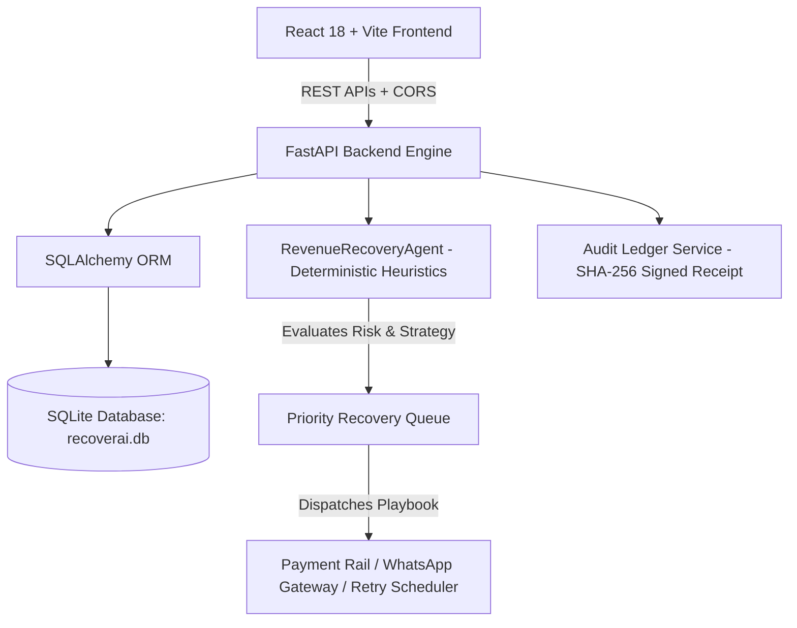

# ⚡ RecoverAI — AI-Powered Revenue Recovery & Payment Salvage Platform

RecoverAI is a high-performance, autonomous **Revenue Recovery Platform** engineered for modern fintech ecosystems and high-volume digital merchants (supporting integrations across Razorpay, Juspay, PayU, Stripe, Cashfree, and banking switches). RecoverAI detects payment failures and cart abandonments (UPI rail timeouts, 3D-Secure drop-offs, mandate expirations, acquirer switch downtimes), evaluates salvage feasibility using deterministic heuristics, and orchestrates automated recovery actions.

---

## 📌 Problem Statement

Digital merchants lose between **2% and 7% of gross transaction volume** to preventable payment drop-offs:
- **Transient UPI Rail Timeouts**: NPCI/Bank switch latency spikes cause consumer checkouts to time out despite funds being debitable.
- **3D-Secure Authentication Friction**: SMS OTP delays and mobile bank page drop-offs cause cart abandonment.
- **Acquirer Downtime**: Bank-side gateway outages silently fail transactions instead of rerouting them to healthy secondary rails.
- **Subscription Mandate Failures**: Recurring auto-debits fail due to balance timing without intelligent retry schedules.

**RecoverAI solves this** by continuously ingesting payment telemetry, calculating salvage probability, and deploying recovery actions (instant failover reroutes, WhatsApp interactive rescue links, and automated retry schedules).

---

## 🚀 Key Features & 9 Integrated Modules

| Module | Route | Functionality |
|---|---|---|
| **Overview Dashboard** | `/` or `/overview` | Real-time recovery KPIs (`Revenue at Risk`, `Recoverable Amount`, `Revenue Recovered`, `Active Cases`), Revenue Pulse Recharts area graph, and AI insight banners. |
| **Revenue Threat Radar** | `/revenue-radar` | Multi-rail gateway health telemetry, active outage threats, root cause breakdown, and regional telecom/banking circle statuses. |
| **Transactions Ledger** | `/transactions` | Complete transaction history with live search, status & risk filtering, full telemetry JSON inspection modal, and CSV export. |
| **AI Agent Studio** | `/ai-agent` | Autonomy toggle, safety budget guardrails, minimum confidence sliders, LLM reasoning engine selector, and **Interactive Live Strategy Sandbox** (`POST /api/agent/analyze`). |
| **Recovery Actions** | `/recovery-actions` | Configured recovery playbooks, status toggles, playbook creation modal, single-transaction intervention queue, and instant dispatch triggers (`POST /api/actions/{id}/execute`). |
| **Analytics & Unit Economics** | `/analytics` | Preserved capital metrics, churn prevention ROI multipliers, gateway efficiency benchmarks, and channel attribution charts. |
| **Cryptographic Audit Trail** | `/audit-trail` | Immutable SHA-256 block ledger logging all autonomous decisions and operator policy changes with verifiable checksums and certificate export. |
| **Recovery Simulation Lab** | `/recovery-lab` | Outage stress-testing sandbox simulating synthetic transaction loads with live heuristic recovery curve trajectories. |
| **Merchant Settings** | `/settings` | Gateway API credentials, webhook endpoints, live backend connectivity latency ping (`GET /api/health`), alert routing, and team RBAC. |

---

## 🛠 Tech Stack

### Frontend
- **Framework**: React 18 (Vite build tool)
- **Styling**: Tailwind CSS (Obsidian dark theme, glassmorphic cards `#111420`, electric violet `#8B5CF6`, cyan `#06B6D4`, and emerald `#10B981` accents)
- **Visualizations**: Recharts (dynamic responsive Area, Bar, and Line charts)
- **Icons**: Lucide React
- **HTTP Client**: Native Fetch API with resilient loading/error/fallback handling

### Backend
- **Framework**: FastAPI (Python 3.11+)
- **Server**: Uvicorn (ASGI)
- **Database**: SQLite (local development) with SQLAlchemy ORM
- **Validation**: Pydantic v2
- **Testing**: Pytest (15 unit tests covering health, transactions CRUD, recovery calculations, and agent heuristics)
- **CORS**: Configured for `http://localhost:5173` and `http://127.0.0.1:5173`

---

## 🏗 System Architecture



---

## 📁 Repository Structure

```
RecoverAI/
├── .gitignore                       # Root git ignore
├── README.md                        # Documentation & setup guide
├── backend/
│   ├── .env.example                 # Backend environment variable template
│   ├── .gitignore                   # Python & SQLite ignore rules
│   ├── pytest.ini                   # Pytest configuration
│   ├── requirements.txt             # Python dependencies
│   ├── data/
│   │   ├── demo_seed.py             # Initial demo database seeder
│   │   └── recoverai.db             # Local SQLite database
│   ├── app/
│   │   ├── main.py                  # FastAPI app entry point & lifespan handler
│   │   ├── config.py                # Environment configuration
│   │   ├── database.py              # SQLAlchemy engine & session factory
│   │   ├── models/                  # DB models (Transaction, RecoveryAction, AuditLog)
│   │   ├── schemas/                 # Pydantic request/response schemas
│   │   ├── routes/                  # API route handlers
│   │   │   ├── health.py            # /api/health
│   │   │   ├── transactions.py      # /api/transactions
│   │   │   ├── recovery.py          # /api/recovery
│   │   │   ├── analytics.py         # /api/analytics
│   │   │   ├── agent.py             # /api/agent
│   │   │   ├── actions.py           # /api/actions
│   │   │   └── audit.py             # /api/audit
│   │   ├── services/                # Business logic (Audit, Recovery)
│   │   └── agents/
│   │       └── recovery_agent.py    # RevenueRecoveryAgent heuristic engine
│   └── tests/
│       ├── conftest.py              # Pytest fixtures & in-memory test DB
│       ├── test_health.py           # Health endpoint tests
│       ├── test_transactions.py     # Transactions CRUD tests
│       ├── test_recovery.py         # Recovery calculations tests
│       └── test_agent.py            # Agent heuristic evaluation tests
└── frontend/
    ├── .env.example                 # Frontend environment template
    ├── .gitignore                   # Node & Vite ignore rules
    ├── index.html                   # HTML template
    ├── package.json                 # Node dependencies & scripts
    ├── vite.config.js               # Vite configuration
    ├── tailwind.config.js           # Obsidian design system tokens
    ├── postcss.config.js
    └── src/
        ├── main.jsx                 # React root mount
        ├── App.jsx                  # Navigation router & toast notifications
        ├── index.css                # Global styles & glassmorphism utilities
        ├── data/
        │   └── mockData.js          # Fallback baseline data
        ├── components/
        │   ├── layout/              # Sidebar, Topbar
        │   ├── dashboard/           # MetricCard, RevenueChart, OpportunityTable
        │   └── common/              # Modal, StatusBadge, Toast
        └── pages/
            ├── Dashboard.jsx        # Overview dashboard
            ├── RevenueRadar.jsx     # Threat radar & gateway telemetry
            ├── Transactions.jsx     # Transactions ledger & telemetry modals
            ├── AIAgent.jsx          # AI studio & live evaluation sandbox
            ├── RecoveryActions.jsx  # Playbooks & manual intervention trigger
            ├── Analytics.jsx        # Unit economics & gateway benchmarks
            ├── AuditTrail.jsx       # Cryptographic SHA-256 compliance logs
            ├── RecoveryLab.jsx      # Outage simulation sandbox
            └── Settings.jsx         # Gateway testing & merchant settings
```

---

## 🧠 AI & Heuristic Decision Engine

RecoverAI incorporates a calibrated, deterministic heuristic engine (`RevenueRecoveryAgent`) designed to mimic fintech payment operations rules with explainable rationales:

| Failure Code | Strategy Executed | Base Certainty | Rationale |
|---|---|---|---|
| `UPI_TIMEOUT` | **Smart UPI Rail Reroute** | 96% | UPI handshake timed out on primary rail; switches to alternate bank switch (ICICI/Axis). |
| `CARD_3DS_DROPOFF` | **Dynamic WhatsApp Cart Salvage** | 88% | Consumer abandoned 3DS authentication; dispatches pre-authenticated 1-click checkout link. |
| `BANK_SERVER_DOWN` | **Smart Rail Failover** | 92% | Issuer rail offline; reroutes payment traffic away from congested bank node. |
| `INSUFFICIENT_FUNDS` | **Smart Retry Scheduler** | 72% | Re-schedules mandate auto-debit on upcoming salary cycle window. |
| `MANDATE_EXPIRED` | **Automated Mandate Renewal** | 78% | Dispatches frictionless 1-click e-mandate re-authorization request. |

---

## 🔌 API Overview

| Method | Endpoint | Description |
|---|---|---|
| `GET` | `/api/health` | Service health status, database connection, and component readiness |
| `GET` | `/api/transactions` | List all transactions with optional status, priority, and risk filters |
| `GET` | `/api/transactions/{id}` | Retrieve single transaction details and recovery telemetry |
| `POST` | `/api/transactions` | Ingest new transaction and trigger automatic agent risk evaluation |
| `GET` | `/api/recovery/summary` | Aggregate recovery metrics (at-risk, recoverable, recovered, success rate) |
| `GET` | `/api/recovery/opportunities` | List top recoverable transaction opportunities |
| `GET` | `/api/analytics/overview` | High-level financial preservation metrics and ROI multipliers |
| `GET` | `/api/analytics/revenue-pulse` | Time-series data points for dynamic recovery charts |
| `GET` | `/api/agent/status` | Active worker threads, autonomy state, and safety thresholds |
| `POST` | `/api/agent/prioritize` | Evaluates and prioritizes all at-risk transactions |
| `POST` | `/api/agent/analyze` | Single-transaction heuristic simulation and strategy recommendation |
| `GET` | `/api/actions` | List all active and configured recovery playbooks |
| `POST` | `/api/actions/{id}/execute` | Dispatch recovery playbook intervention for a transaction |
| `GET` | `/api/audit` | Retrieve cryptographic immutable audit ledger with SHA-256 block receipts |

Interactive Swagger documentation is available at `http://localhost:8000/docs`.

---

## ⚡ Installation & Setup Instructions

### Prerequisites
- **Node.js** (v18 or higher)
- **Python** (v3.11 or higher)
- **Git**

### 1. Clone the Repository
```bash
git clone https://github.com/your-username/RecoverAI.git
cd RecoverAI
```

### 2. Backend Setup
```bash
# Navigate to backend directory
cd backend

# Create and activate virtual environment
# On Windows:
python -m venv .venv
.venv\Scripts\activate

# On Linux/macOS:
# python3 -m venv .venv
# source .venv/bin/activate

# Install dependencies
pip install -r requirements.txt

# (Optional) Copy environment file
cp .env.example .env

# Run backend development server
uvicorn app.main:app --host 0.0.0.0 --port 8000 --reload
```

Backend will be running at `http://localhost:8000` (API Docs: `http://localhost:8000/docs`).

### 3. Frontend Setup
Open a new terminal window:
```bash
# Navigate to frontend directory
cd frontend

# Install dependencies
npm install

# Start Vite development server
npm run dev
```

Frontend will be running at `http://localhost:5173`.

---

## 🧪 Testing Instructions

Run the automated backend test suite with Pytest:
```bash
cd backend
.venv\Scripts\pytest -v
```

Build the frontend for production verification:
```bash
cd frontend
npm run build
```

---

## 💡 Example API Usage

### Real-Time Heuristic Strategy Evaluation
```bash
curl -X POST http://localhost:8000/api/agent/analyze \
  -H "Content-Type: application/json" \
  -d '{
    "amount": 85000,
    "payment_method": "UPI",
    "failure_reason": "UPI_TIMEOUT",
    "gateway": "Razorpay"
  }'
```

**Response:**
```json
{
  "transaction_id": null,
  "recovery_probability": 96.0,
  "risk_level": "High",
  "priority": "High",
  "recommended_action": "Smart UPI Rail Reroute",
  "action_strategy": "Reroute VPA handle to high-uptime alternate bank switch (ICICI/Axis)",
  "explainability_rationale": "UPI handshake timed out on primary rail (Razorpay). Transient bank switch congestion detected.",
  "estimated_salvageable_amount": 81600.0,
  "auto_executable": true
}
```

---

## 🔮 Future Improvements
- Multi-region Postgres clustering with read replicas for high-throughput webhook ingestion (10k+ TPS).
- Webhook signature verification adapters for Stripe, Juspay, and Razorpay event feeds.
- Automated WhatsApp Business Cloud API integration for instant customer payment link delivery.
- LLM fine-tuning on merchant customer communication patterns for personalized discount incentives.

---

## 👤 Author
**Isiri H S**
**https://github.com/isiri056**
